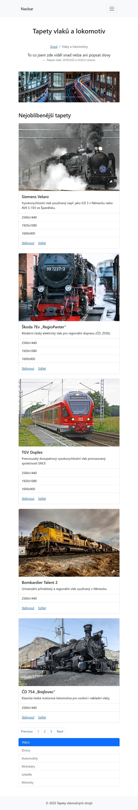
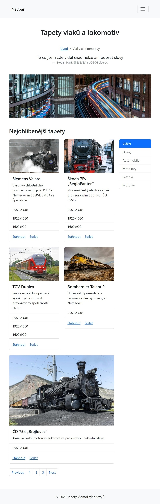
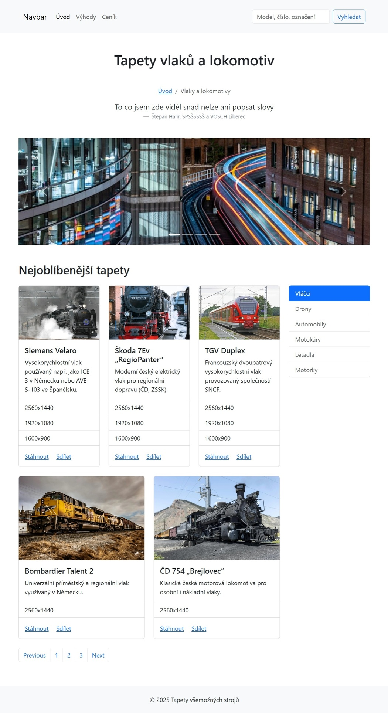
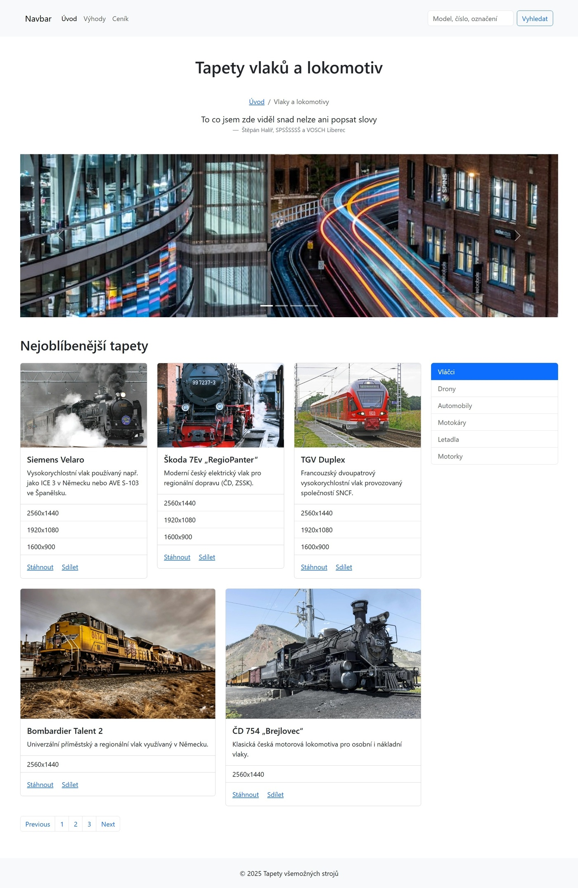

# Webová stránka "Tapety vlaků a lokomotiv" - Bootstrap 5 cvičení

Tato webová stránka slouží jako předloha pro cvičení práce s HTML a Bootstrap 5 frameworkem. Stránka představuje galerii tapet s vlaky a lokomotivami s responzivním designem.

## Kroky k vytvoření webové stránky

### 1. Základní HTML struktura
- Vytvořte HTML5 dokument s českým jazykem (`lang="cs"`)
- Přidejte meta viewport pro responzivní zobrazení
- Vložte odkazy na Bootstrap 5 CSS a JS z CDN

### 2. Layout a struktura stránky
Stránka se skládá z následujících sekcí:
- **Header** s navigací
- **Main** s obsahem
- **Footer** s copyrightem

### 3. Použité Bootstrap komponenty

#### Navigace (Navbar)
- `navbar` - základní navigační lišta
- `navbar-expand-lg` - rozbalení na velkých obrazovkách
- `navbar-toggler` - hamburger menu pro mobily
- `collapse navbar-collapse` - kolapsibilní obsah
- `navbar-nav`, `nav-item`, `nav-link` - navigační položky

#### Grid systém
- `container` - obalový kontejner s responzivní šířkou
- `row` - řádky gridu
- `col-md-9`, `col-md-3` - sloupce (9:3 poměr na medium+ zařízeních)
- `col-md-6`, `col-lg-4` - karty v gridu (2 na medium, 3 na large)
- `g-4` - mezery mezi sloupci

#### Komponenty
- **Carousel** (`carousel slide`) - slider s obrázky
  - `carousel-indicators` - indikátory slidů
  - `carousel-inner`, `carousel-item` - obsah slidů
  - `carousel-control-prev/next` - navigační tlačítka
- **Cards** (`card`) - karty s obrázky vlaků
  - `card-img-top` - obrázek v hlavičce karty
  - `card-body` - tělo karty s textem
  - `card-title`, `card-text` - nadpis a text karty
  - `card-link` - odkazy v kartě
- **List group** (`list-group`) - seznamy
  - `list-group-flush` - seznam bez okrajů
  - `list-group-item` - položka seznamu
  - `list-group-item-action` - interaktivní položka
- **Breadcrumb** (`breadcrumb`) - navigační drobečky
- **Pagination** (`pagination`) - stránkování
- **Blockquote** (`blockquote`) - citát s autorem

#### Utility třídy
- **Spacing**: `my-5`, `mt-4`, `mb-1`, `p-3`, `p-4` - marginy a paddingy
- **Text**: `text-center` - zarovnání textu na střed
- **Colors**: `bg-body-tertiary` - pozadí
- **Flex**: `justify-content-center` - pro centrování obsahu v **Breadcrumb**

### 4. Responzivní chování

#### Breakpointy Bootstrap 5:
- **xs** (< 576px) - velmi malé displeje
- **sm** (≥ 576px) - malé displeje  
- **md** (≥ 768px) - střední displeje (tablety)
- **lg** (≥ 992px) - velké displeje (desktopy)
- **xl** (≥ 1200px) - velmi velké displeje

#### Očekávané responzivní chování:

**Mobilní zařízení (< 768px):**
- Navbar se skrývá do hamburger menu
- Karty se zobrazují v jednom sloupci pod sebou
- Postranní panel se zobrazuje pod hlavním obsahem
- Carousel zůstává funkční s touch navigací

**Tablety (768px - 991px):**
- Navbar zůstává rozbalený
- Hlavní obsah zabírá 9 sloupců, sidebar 3 sloupce
- Karty se zobrazují ve 2 sloupcích (`col-md-6`)

**Desktop (≥ 992px):**
- Plné zobrazení všech komponent
- Karty se zobrazují ve 3 sloupcích (`col-lg-4`)
- Optimální využití širokého displeje

### 5. Soubory a struktura

```
├── index.html          # Hlavní HTML soubor
├── images/             # Složka s obrázky
│   ├── card_img_1.webp # Obrázky pro karty
│   ├── card_img_2.webp
│   ├── card_img_3.webp
│   ├── card_img_4.webp
│   ├── card_img_5.webp
│   ├── slide_1.webp    # Obrázky pro carousel
│   ├── slide_2.webp
│   ├── slide_3.webp
│   └── slide_4.webp
└── README.md           # Tento soubor
```

### 6. Doporučený postup vytvoření

1. **Založení projektu** - vytvořte HTML soubor s Bootstrap CDN
2. **Header a navigace** - implementujte responzivní navbar
3. **Základní layout** - vytvořte container a grid strukturu
4. **Carousel** - přidejte posuvný banner s obrázky
5. **Grid s kartami** - vytvořte responzivní galerii karet
6. **Sidebar** - přidejte postranní navigaci s list-group
7. **Pagination** - implementujte stránkování
8. **Footer** - dokončete stránku patičkou
9. **Testování** - ověřte responzivní chování na různých zařízeních

### 7. Technické poznámky

- Používá se Bootstrap 5.3.8 z CDN
- Všechny obrázky jsou ve formátu WebP pro optimalizaci
- Stránka je přístupná (obsahuje ARIA atributy)
- Český obsah s příslušnými meta informacemi

### 8. Testování responzivity

Pro otestování různých breakpointů:
1. Otevřete Developer Tools (F12)
2. Aktivujte Device Mode (Ctrl+Shift+M)
3. Testujte na šířkách: 576px (SM), 768px (MD), 992px (LG), 1200px (XL)
4. Ověřte, že se layout správně přeuspořádá na každém breakpointu

### Klíčové responzivní změny

1. **Navbar**: Zůstává rozbalený od MD breakpointu (768px+)
2. **Grid layout**: 
   - SM/XS: Karty pod sebou (1 sloupec)
   - MD: 2 sloupce karet (`col-md-6`) 
   - LG+: 3 sloupce karet (`col-lg-4`)
3. **Sidebar**: Pod hlavním obsahem na malých displejích, vpravo od MD+
4. **Carousel**: Responzivní na všech velikostech s touch podporou


## Náhledy responzivního designu

Následující screenshoty demonstrují, jak se stránka zobrazuje na různých šířkách viewportů podle Bootstrap breakpointů:

### MD - Střední displeje (768px+)
**Viewport: 720px**


**Viewport: 800px**  


*Na středních displejích (tablety) se aktivuje dvousloupcový layout. Sidebar zůstává vpravo, karty se zobrazují ve 2 sloupcích díky `col-md-6`.*

### LG - Velké displeje (992px+)
**Viewport: 1050px**


*Na velkých displejích se karty přeuspořádají do 3 sloupců pomocí `col-lg-4`, což poskytuje optimální využití prostoru.*

### XL - Extra velké displeje (1200px+)
**Viewport: 1400px**


*Na extra velkých displejích zůstává trojsloupcové rozložení karet, ale s větším prostorem pro obsah a lepší čitelností.*

